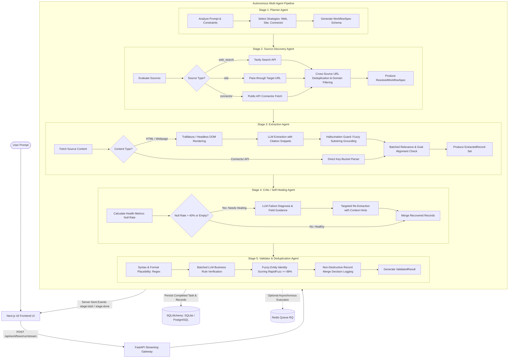
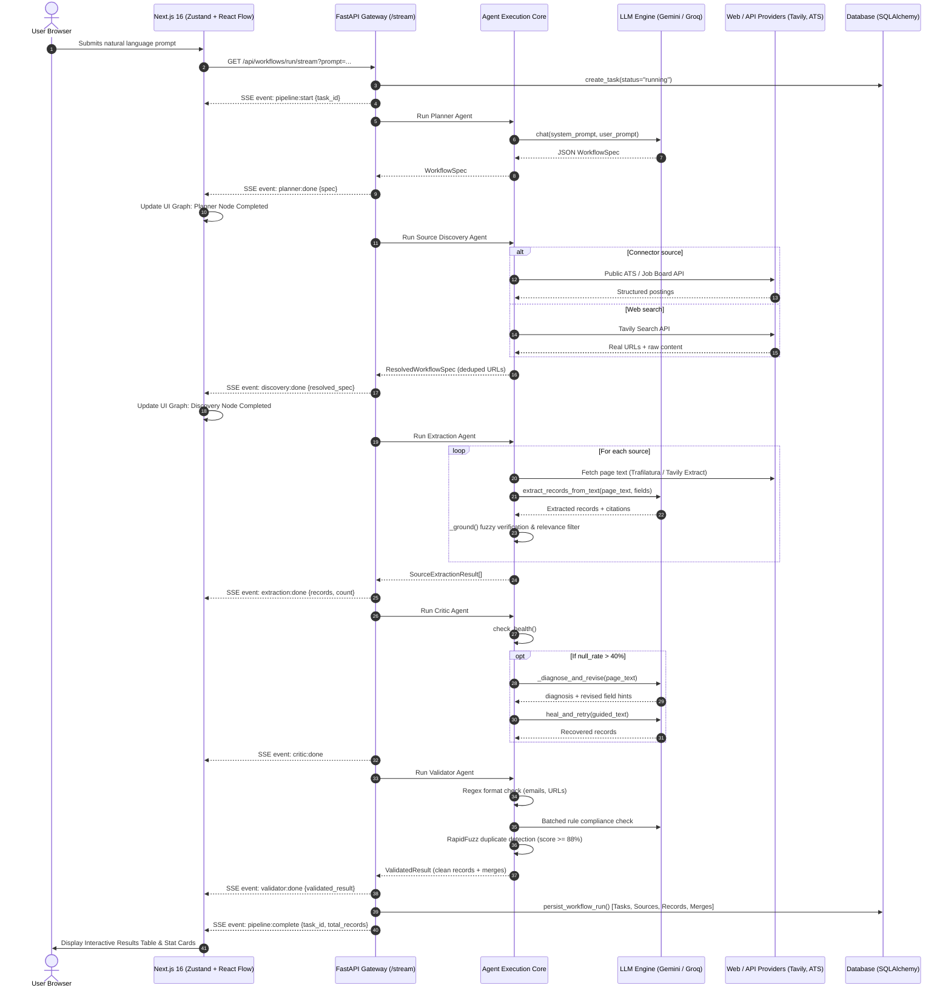
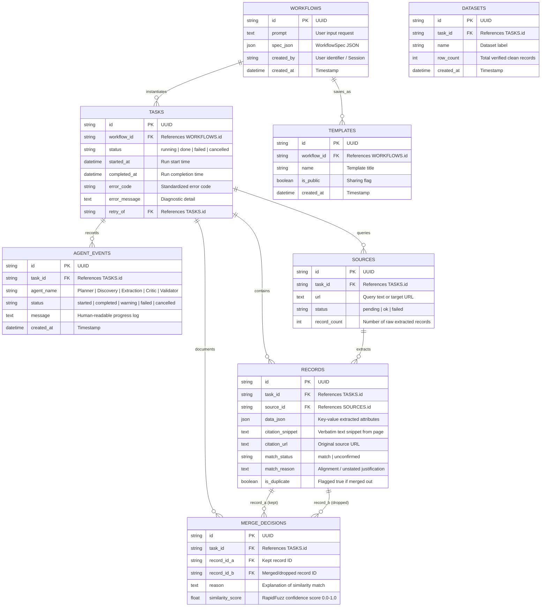
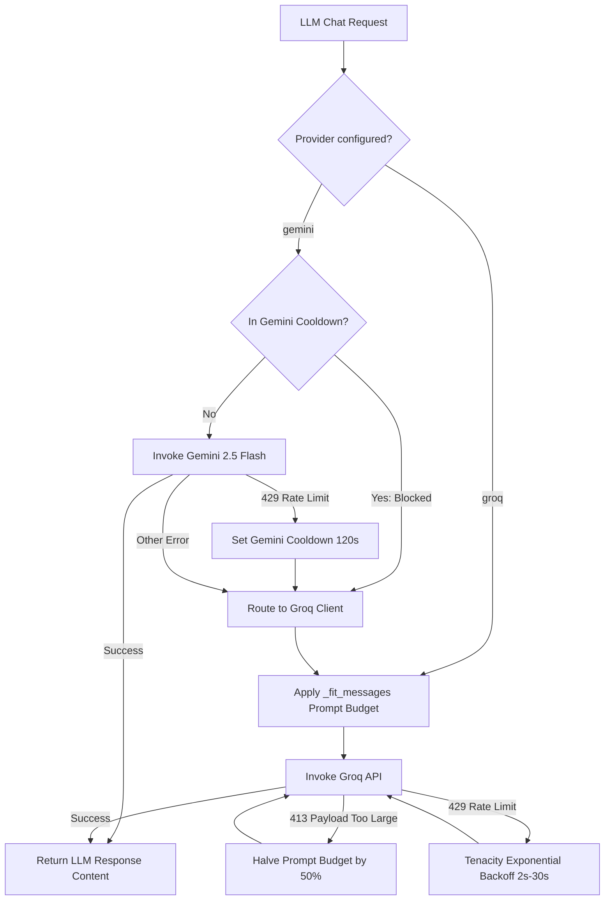
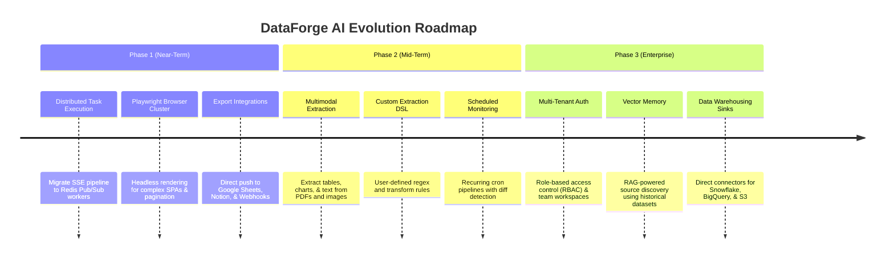

# DataForge AI — Comprehensive System Documentation & Technical Blueprint (A to Z)

---

## Executive Summary

**DataForge AI** is an autonomous, agentic data engineering and web synthesis platform designed to turn arbitrary, natural-language dataset requests into clean, validated, source-grounded, deduplicated structured datasets. 

Traditional approaches to web data collection suffer from severe operational trade-offs:
1. **Manual / Scripted Web Scraping**: Fragile CSS/XPath selectors break whenever target websites update their DOM structure, requiring continuous developer intervention and maintenance.
2. **Naive LLM Scraping ("Prompt-and-Pray")**: Passing raw scraped text or search snippets directly to an LLM without strict grounding mechanisms leads to severe hallucinations, fabricated contact details, invented pricing, and phantom records.
3. **Black-Box Data Aggregators**: Closed third-party APIs offer static schemas, lack source auditability, cannot adapt to niche user requirements, and provide zero visibility into data provenance.

DataForge AI resolves these limitations through a **coordinated multi-agent pipeline** powered by LangGraph, FastAPI, and Next.js 16. It couples broad internet discovery (via Tavily) and authoritative ATS/job APIs (Greenhouse, Lever, Adzuna, RemoteOK, Arbeitnow, USAJobs) with an active **Critic / Self-Healing loop**, strict **Fuzzy Substring Grounding**, and an **Audited Deduplication & Validation engine**. Every extracted record maintains a cryptographically traceable citation to its source URL and verbatim text snippet.

---

## 1. System Architecture & High-Level Design

DataForge AI is architected as a distributed, decoupled full-stack platform consisting of:
- **Frontend Presentation Layer**: Next.js 16 (App Router), React 19, TypeScript, Tailwind CSS 4, `@xyflow/react` (for dynamic pipeline graph visualization), and Zustand (for reactive workflow state).
- **API & Streaming Gateway**: FastAPI with native asynchronous Server-Sent Events (SSE) for millisecond-latency stage telemetry.
- **Agent Orchestration Engine**: Deterministic LangGraph state machine with dual execution modes (real-time async SSE generator and synchronous batch runner).
- **LLM Resilience & Multi-Provider Layer**: Dynamic failover architecture switching seamlessly between Google Gemini (`gemini-2.5-flash`) and Groq (`openai/gpt-oss-120b`), equipped with exponential backoff, character budget fitting, and HTTP 413 recovery.
- **Data Persistence & Task Queue Layer**: SQLAlchemy 2 ORM compatible with SQLite (zero-config local dev) and PostgreSQL (production), paired with Redis and Python-RQ for background job scheduling.

---

## 2. Complete Architecture Diagrams

### 2.1 End-to-End Pipeline & Agent Loop Flowchart



---

### 2.2 Sequence Diagram: Real-Time Streaming & Client-Server Interaction



---

### 2.3 Database Schema Entity-Relationship (ER) Diagram



---

## 3. Detailed "A to Z" Implementation Walkthrough

### 3.1 The 5 Specialized Autonomous Agents

#### 1. Planner Agent (`backend-py/app/agents/planner.py`)
- **Core Function**: Converts unstructured, ambiguous user requests into a strict, validated `WorkflowSpec` Pydantic model.
- **System Prompt Design**:
  - Enforces schema output: `goal`, `fields`, `sources`, `validation_rules`, `dedupe_strategy`, `exclude_domains`.
  - Intelligently chooses source types: `web_search` for open internet queries, `site` for specific user-provided URLs, and `connector` for structured ATS / job-board APIs.
  - Connector heuristic routing:
    - `adzuna`: General keyword and regional job searches with location fallback.
    - `greenhouse` / `lever`: Official company ATS boards mapped from company slugs.
    - `remoteok`: Remote-only tech roles.
    - `arbeitnow`: European and international jobs.
    - `usajobs`: US Federal Government roles.
  - Negative constraints: Automatically extracts `exclude_domains` when the user requests avoiding certain websites.
- **Resilience Mechanism**: Handles cases where LLMs wrap individual source items as JSON strings instead of JSON objects; cleans markdown fences and runs Pydantic runtime schema validation.

#### 2. Source Discovery Agent (`backend-py/app/agents/source_discovery.py`)
- **Core Function**: Enriches abstract source specifications into concrete, reachable web targets (`ResolvedWorkflowSpec`).
- **Web Search Integration**: Connects to the Tavily Search API with `include_raw_content=True` and `max_results=3` per query.
- **Domain Blacklisting**: Strips subdomains/protocols and rejects URLs belonging to user-excluded domains.
- **Cross-Source URL Deduplication**: Maintains a global `seen_urls` set during resolution. If two distinct search angles surface the exact same URL, the duplicate is dropped immediately, saving unnecessary LLM token spend during extraction.
- **Connector Dispatch**: Routes connector specs directly to official API clients (`app/connectors/`).

#### 3. Extraction Agent (`backend-py/app/agents/extraction.py`)
- **Core Function**: Fetches target content, extracts structured fields according to schema, captures exact source citations, and protects against LLM hallucinations.
- **Dual Content Ingestion**:
  1. *Structured APIs*: Fast direct key-value mapping from pre-structured header blocks without LLM overhead.
  2. *Unstructured Web*: Fetches via HTTPX + Trafilatura. If the page is a thin client-rendered JavaScript shell (< 4000 characters), it automatically escalates to Tavily's advanced headless browser extractor.
- **Truncation Strategy (`_head_tail`)**: Large web pages are trimmed to preserve the top 60% and bottom 40% (since qualification criteria, salary, and contact links typically reside in footers or final sections).
- **Resilient JSON Salvaging (`_salvage_json_array`)**: If an LLM call hits token cutoff mid-stream, a custom decoder walks the partial JSON stream and salvages all fully-formed objects.
- **Hallucination Guard (`_ground`)**:
  - Every extracted value is checked against the raw normalized and whitespace-squashed source text.
  - Short strings, numbers, dates, and links must match exactly.
  - Longer prose must achieve a `RapidFuzz.partial_ratio >= 80`. Any value failing this threshold is replaced with `None`, completely preventing made-up phone numbers, emails, or fake requirements.
- **Relevance & Semantic Filter (`filter_relevant`)**:
  - Runs a batched semantic check evaluating records against the user's high-level goal.
  - Employs a *Keep-if-Unsure* policy:
    - Clear contradictions (e.g., Senior role when fresher was requested) are dropped.
    - Matches are tagged `match_status="match"`.
    - Ambiguous records (e.g., years of experience not explicitly stated on page) are retained but flagged as `match_status="unconfirmed"` with the model's justification displayed in the UI.

#### 4. Critic / Self-Healing Agent (`backend-py/app/agents/critic.py`)
- **Core Function**: Automated quality assurance agent that monitors extraction performance and performs targeted healing when extractions fail.
- **Health Inspection (`check_health`)**: Computes the null-field ratio (`empty_cells / total_cells`). If the extraction yielded 0 records or the null rate exceeds 40% (`NULL_RATE_THRESHOLD = 0.4`), the source is flagged for healing.
- **Root-Cause Diagnosis (`_diagnose_and_revise`)**: Prompts the LLM with the page text and previous empty extractions to produce:
  1. A one-sentence technical diagnosis of why extraction failed (e.g., "Field names were nested inside a tabbed accordion layout").
  2. Explicit, contextual field hints tailored to this specific page structure.
- **Guided Retry (`heal_and_retry`)**: Re-prompts the extraction engine with the newly synthesized field hints injected directly into the prompt context, recovering records that would otherwise be lost.

#### 5. Validator & Deduplication Agent (`backend-py/app/agents/validator.py`)
- **Core Function**: Final stage gate ensuring data integrity, business rule compliance, and entity deduplication.
- **Syntactic Plausibility**: Enforces RFC-compliant email regex (`EMAIL_RE`) and valid URL prefixes.
- **Batched Business Rule Verification**: Batches up to 15 records per LLM prompt to verify adherence to custom rules specified by the user during planning (e.g., "Salary must be above $80k"). Violations are appended to record `flags` without dropping the row, giving users full visibility.
- **Entity Resolution & Deduplication**:
  - Constructs a compound primary identity key combining all name, title, and company fields (preventing false deduplication across different employers).
  - Calculates string similarity using `RapidFuzz.ratio`. Pairs scoring >= 88% (`DUPLICATE_NAME_THRESHOLD`) are marked as duplicates.
  - Generates transparent `MergeDecision` records capturing `kept_index`, `dropped_index`, `similarity_score`, and human-readable justification.

---

### 3.2 Structured Provider Connectors (`backend-py/app/connectors/`)

DataForge AI integrates directly with official recruitment and job-board APIs:
- **Greenhouse (`greenhouse.py`)**: Consumes the official public endpoint `https://boards-api.greenhouse.io/v1/boards/{company}/jobs?content=true`. Strips HTML markup, performs loose token pre-filtering on job titles, and returns full job descriptions without web scraping.
- **Lever (`lever.py`)**: Queries `https://api.lever.co/v0/postings/{company}?mode=json`, parsing company openings directly into structured postings.
- **Adzuna (`adzuna.py`)**: Integrates with Adzuna's programmatic search API. Supports automated location synonym translation (e.g., "Bangalore" $\leftrightarrow$ "Bengaluru") and multi-page pagination.
- **RemoteOK (`remoteok.py`)**: Consumes RemoteOK's public JSON feed, filtering by tags and skills.
- **Arbeitnow (`arbeitnow.py`)**: Fetches European and remote tech postings.
- **USAJobs (`usajobs.py`)**: Queries the official US Office of Personnel Management API for federal employment openings.

---

### 3.3 LLM Orchestration & Failover Engine (`backend-py/app/llm.py`)

A critical bottleneck in autonomous agent systems is LLM rate-limiting (HTTP 429), token quotas, and payload size errors (HTTP 413). DataForge AI implements an enterprise-grade LLM resilience layer:



1. **Dual-Provider Architecture**: Supports Google Gemini (`gemini-2.5-flash`) and Groq (`openai/gpt-oss-120b`).
2. **Dynamic Failover & Cooldown**: When Gemini returns HTTP 429 (Resource Exhausted), DataForge activates a 120-second cooldown timer (`_gemini_blocked_until`) and immediately routes all pending and subsequent agent calls to Groq without crashing the pipeline.
3. **Prompt Fitting (`_fit_messages`)**: Truncates the longest message in the prompt context to fit within strict character limits (`GROQ_MAX_PROMPT_CHARS = 8000`), preserving the head and tail of instructions.
4. **HTTP 413 Dynamic Recovery**: If Groq rejects a prompt with HTTP 413 (Request Entity Too Large), the engine catches the error, cuts the prompt character budget in half (`limit // 2`), and automatically retries.
5. **Cold-Start Absorption**: LangChain initializations can introduce a 60-second lazy-load delay on the first call. FastAPI's startup lifecycle (`@app.on_event("startup")`) issues a lightweight warm-up query (`plan_workflow("warmup")`) so end-users never experience cold-start lag.

---

### 3.4 Real-Time Streaming Gateway (`backend-py/app/stream.py`)

The pipeline communicates progress to the frontend via an SSE stream (`/api/workflows/run/stream`):
- **Lifecycle Events**:
  - `pipeline:start`: Emits generated `task_id` and timestamp.
  - `planner:start` / `planner:done`: Emits complete `WorkflowSpec`.
  - `discovery:start` / `discovery:done`: Emits resolved URLs count and `ResolvedWorkflowSpec`.
  - `extraction:start` / `extraction:done`: Emits extracted record count and warnings.
  - `critic:start` / `critic:done`: Emits health metrics and healing actions.
  - `validator:start` / `validator:done`: Emits clean records, validation issues, and deduplication merges.
  - `pipeline:complete`: Emits final record counts and persistence confirmations.
  - `pipeline:cancelled`: Emitted upon user-triggered cancellation.
  - `pipeline:error`: Emits standardized failure diagnostics.
- **Cancellation Tokens**: Cooperative cancellation using Python `asyncio.Event`. When a user clicks **Stop** in the UI, `/api/tasks/{task_id}/cancel` sets the cancellation event. The background pipeline checks `_cancelled(task_id)` at every agent boundary and terminates execution cleanly without leaving orphan tasks.

---

### 3.5 Database & Task Persistence Layer (`backend-py/app/db/`)

DataForge AI uses SQLAlchemy 2 with a portable, database-agnostic schema:
- **Multi-Database Support**: Defaults to SQLite for local development (`dataforge.db`) and switches automatically to PostgreSQL when `DATABASE_URL` is defined in production.
- **Relational Integrity**:
  - `Workflow`: Persists original user prompts and planned specifications.
  - `Task`: Tracks task status (`running`, `done`, `failed`, `cancelled`), execution timestamps, and failure error codes. Supports lineage tracking via `retry_of` foreign keys.
  - `AgentEvent`: Granular timeline log of each agent stage for historical debugging.
  - `Source`: Captures target queries/URLs and their extraction yield.
  - `Record`: Stores extracted JSON data, citation URLs, exact text snippets, and `match_status`.
  - `MergeDecisionModel`: Complete audit trail of duplicate records, recording which record was retained, which was dropped, the `similarity_score`, and the rationale.

---

### 3.6 Frontend Implementation & User Experience

Built on Next.js 16 App Router, React 19, and Tailwind CSS 4:
- **Live Agent Graph (`components/workflow/pipeline-graph.tsx`)**:
  - Implemented using `@xyflow/react`.
  - Renders the 5 pipeline stages as interconnected reactive nodes (`AgentNode`).
  - Active nodes pulse with glowing cyan borders and spinning indicators; completed nodes turn emerald green; failed nodes turn rose red.
  - Custom SVG bezier edges (`AnimatedEdge`) feature glowing paths and **animated streaming particle pulses** that travel along the connector lines between currently active agents.
- **Reactive Workflow Store (`hooks/use-workflow-state.ts`)**:
  - Zustand-powered state management.
  - Decouples UI rendering from network transport; handles out-of-order SSE events, tracks real-time progress percentages, and buffers log lines.
- **Interactive Results Table (`components/workflow/results-table.tsx`)**:
  - Dynamic column rendering based on extracted JSON keys.
  - In-memory real-time search across all extracted values and citation links.
  - Multi-directional column sorting.
  - Visual Verification Badges:
    - `Verified` (Emerald Shield): Record strictly satisfies user criteria and passed grounding checks.
    - `Unconfirmed` (Amber Shield): Record kept under the keep-if-unsure policy, with tooltip explaining why the page omitted specific criteria.
    - `Alert Triangle` (Rose): Flags validation warnings (invalid email formatting, rule violations).
  - Direct external link triggers to inspect source pages.
- **Data Export & Portability**:
  - Instant client-side CSV generation with quote escaping (`lib/csv.ts`).
  - Formatted JSON clipboard export.
- **Operational Dashboards & History**:
  - `/dashboard`: Metrics dashboard displaying total runs, success rates, records collected, and average yield per run using Framer Motion animated counters.
  - `/history`: Historical log of all executions with status badges and one-click replay.
  - `/datasets`: Library of finished datasets ready for instant CSV download.

---

## 4. Why Is This Implementation Good? (Core Design Rationale)

1. **Zero Hallucination Tolerance via Fuzzy Grounding**:
   Unlike generic LLM wrappers that trust generative model outputs blindly, DataForge enforces an algorithmic grounding check (`_is_grounded`). If an LLM fabricates a salary, email, or requirement that does not exist in the source document text, the value is forcefully nulled out before reaching the user.
2. **Self-Healing Resilience (The Critic Agent)**:
   In conventional scrapers, when a web page layout changes or an LLM fails to extract data, the pipeline simply returns 0 rows. DataForge’s Critic agent catches high null rates, diagnoses layout obstacles, generates custom hints, and performs a guided retry.
3. **Keep-If-Unsure Verification Badging**:
   Many scrapers either drop records aggressively (causing high false-negative rates) or accept irrelevant records (high false-positive rates). DataForge's relevance classifier drops only explicit contradictions, while labeling unconfirmed records with transparent warning badges.
4. **Hybrid Source Architecture (Clean APIs + Broad Search)**:
   Instead of scraping anti-bot protected career pages with brittle browser automation, the system routes corporate job queries to official public APIs (Greenhouse, Lever, Adzuna), reserving broad web searches for unstructured targets.
5. **Transparent, Audited Deduplication**:
   Deduplication does not silently delete records. Every merge decision records the exact string similarity score, the fields compared, and the reasoning in the database (`MergeDecisionModel`), allowing users to audit why records were merged.
6. **Production-Grade Network & LLM Fault Tolerance**:
   Equipped with dynamic Gemini-to-Groq fallback, prompt halving on HTTP 413, cold-start absorption on startup, and SSE reconnection logic, ensuring high availability even on free-tier LLM infrastructure.
7. **Developer Experience & Real-Time Observability**:
   Users are never left staring at a blank loading spinner. The `@xyflow/react` pipeline graph, live log terminal feed, and incremental record counters provide real-time visibility into agent reasoning.

---

## 5. Advantages & Disadvantages

### 5.1 Key Advantages

| Category | Advantage | Technical Justification |
| :--- | :--- | :--- |
| **Data Quality** | **Zero-Hallucination Guarantee** | Fuzzy substring grounding (`RapidFuzz`) validates every generated token against source DOM text. |
| **Pipeline Reliability** | **Self-Healing Recovery** | The Critic agent re-inspects failed sources, generates prompt guidance, and recovers missing data automatically. |
| **Cost Efficiency** | **Intelligent Token Budgeting** | Pre-structured API connectors bypass LLMs entirely; text truncation (`_head_tail`) minimizes context overhead. |
| **Observability** | **Real-Time Visual DAG** | Server-Sent Events stream pipeline events to a dynamic `@xyflow/react` graph with animated particle edges. |
| **Auditability** | **Full Source Provenance** | Every single extracted field links to its original URL and verbatim excerpt snippet. |
| **Fault Tolerance** | **Multi-Provider Failover** | Automatic Gemini cooldown with seamless failover to Groq prevents rate-limit halts. |
| **Portability** | **Single-Command Local & Cloud Setup** | Database-agnostic SQLAlchemy architecture runs out-of-the-box on SQLite and scales to PostgreSQL. |

---

### 5.2 Disadvantages & Current Limitations

| Limitation | Impact | Technical Context |
| :--- | :--- | :--- |
| **Heavy Client-Side JS Scrapes** | Potential missing content | While Tavily extract handles dynamic pages, complex SPAs behind multi-step authentication or CAPTCHAs cannot be scraped. |
| **Rate-Limit Latency on Free Tiers** | Slower extraction on large runs | When running on free Groq/Gemini tiers, exponential backoff and rate-limit delays can increase runtimes. |
| **Non-Persistent Stream Replay** | Browser refresh disconnects live stream | If a user refreshes the page mid-stream, the SSE connection closes; the run continues on the backend, but live visualization is reset until persisted. |
| **Single-Page Depth per Source** | Limited multi-page traversal | The Source Discovery agent resolves the top 3 direct URLs per query but does not perform multi-level recursive link crawling. |
| **Memory-Buffered In-Process Tasks** | Scalability bottleneck under heavy load | In local mode, pipeline stages execute via `asyncio.to_thread` within the FastAPI process rather than distributed worker pods. |

---

## 6. Drawbacks & Technical Debt

1. **Lack of Headless Browser Cluster**:
   The current web extraction uses Trafilatura and Tavily Extract. Highly dynamic websites that require user interactions (clicking "Load More", scrolling down infinite feeds, solving Cloudflare turnstile) cannot be fully rendered without an integrated Playwright/Puppeteer cluster.
2. **Synchronous Worker Fallback**:
   While Redis Queue (RQ) structures are implemented (`backend-py/app/workers/extraction_worker.py`), the default streaming route (`_run_pipeline_stream`) executes worker stages in-thread via `asyncio.to_thread`. High concurrency requires migrating the SSE generator to listen to Redis Pub/Sub channels.
3. **Coarse-Grained Deduplication Threshold**:
   Deduplication currently relies on an 88% fuzzy ratio on concatenated identity fields. While effective for job listings and company names, it can produce edge-case collisions on short, ambiguous names.
4. **Transient Critic Logs in History**:
   When loading a past run from the `/history` screen, the historical view reconstructs the clean dataset and merge decisions, but the granular intermediate Critic diagnosis logs are not serialized into the final task response.

---

## 7. Future Enhancements & Strategic Roadmap



1. **Distributed Headless Browser Pool**:
   Integrate a containerized Playwright / Browserless cluster to automate pagination, infinite scrolls, and interactive JavaScript applications.
2. **Scheduled Workflows & Change Detection (Diffing)**:
   Enable users to set recurring cron schedules (e.g., "Run every Monday at 9 AM"). The pipeline will run automatically, diff the new records against previous runs, and send email/Slack webhook alerts on newly discovered items.
3. **Enterprise Export Sinks**:
   Direct push integrations for Google Sheets, Notion databases, Airtable, Snowflake, BigQuery, and AWS S3 bucket partitions.
4. **Multimodal Extraction (PDF & Image OCR)**:
   Incorporate multimodal vision models to extract structured data from PDF whitepapers, scanned balance sheets, and catalog screenshots.
5. **User Authentication & Multi-Tenancy**:
   Implement NextAuth / Clerk on the frontend with JWT validation on FastAPI, allowing multi-user isolation, team workspaces, API keys, and usage quotas.
6. **Vector-Augmented Source Discovery**:
   Index historical extractions into a vector database (e.g., pgvector / Qdrant) so the Source Discovery agent can reuse high-authority URLs discovered in past runs.

---

## 8. Directory & File Structure Reference

```text
DataForgeAI/
├── max.md                               # Complete system documentation (this file)
├── README.md                            # Quickstart and overview guide
│
├── backend-py/                          # Python Backend Service
│   ├── requirements.txt                 # Backend dependencies (FastAPI, LangGraph, etc.)
│   ├── .env.example                     # Environment template
│   ├── app/
│   │   ├── __init__.py
│   │   ├── main.py                      # FastAPI application, CORS, and REST routes
│   │   ├── schemas.py                   # Pydantic data models & contracts
│   │   ├── graph.py                     # LangGraph StateGraph orchestration
│   │   ├── stream.py                    # Server-Sent Events (SSE) streaming engine
│   │   ├── llm.py                       # Resilient multi-provider LLM client
│   │   ├── agents/                      # The 5 Core Specialized Agents
│   │   │   ├── __init__.py
│   │   │   ├── planner.py               # Natural language planning agent
│   │   │   ├── source_discovery.py      # Search & URL discovery agent
│   │   │   ├── extraction.py            # DOM extraction & grounding agent
│   │   │   ├── critic.py                # Self-healing & quality agent
│   │   │   └── validator.py             # Deduplication & rule validation agent
│   │   ├── connectors/                  # Structured API Provider Integrations
│   │   │   ├── __init__.py              # Provider dispatcher
│   │   │   ├── adzuna.py                # Adzuna job aggregator client
│   │   │   ├── greenhouse.py            # Greenhouse ATS board API client
│   │   │   ├── lever.py                 # Lever ATS board API client
│   │   │   ├── remoteok.py              # RemoteOK jobs API client
│   │   │   ├── arbeitnow.py             # Arbeitnow European jobs API client
│   │   │   └── usajobs.py               # USAJobs federal jobs API client
│   │   ├── db/                          # Persistence & Queue Layer
│   │   │   ├── __init__.py
│   │   │   ├── database.py              # SQLAlchemy engine & session factory
│   │   │   ├── models.py                # Database ORM entity definitions
│   │   │   ├── persist.py               # Database write & query operations
│   │   │   ├── queue.py                 # Redis Queue (RQ) configuration
│   │   │   └── redis_client.py          # Redis connection & pub/sub helpers
│   │   └── workers/                     # Background Job Workers
│   │       ├── __init__.py
│   │       └── extraction_worker.py     # Standalone RQ extraction worker process
│
└── frontend/                            # Next.js 16 Web Application
    ├── package.json                     # Frontend dependencies
    ├── tsconfig.json                    # TypeScript compiler configuration
    ├── next.config.ts                   # Next.js configuration
    ├── app/                             # Next.js App Router Pages
    │   ├── layout.tsx                   # Global app layout & font setup
    │   ├── page.tsx                     # Landing page with prompt input & aurora effect
    │   ├── globals.css                  # Tailwind CSS 4 styling & design tokens
    │   ├── workflow/
    │   │   └── page.tsx                 # Live SSE workflow execution & results screen
    │   ├── dashboard/
    │   │   └── page.tsx                 # Analytics & run metrics dashboard
    │   ├── history/
    │   │   └── page.tsx                 # Historical workflow run explorer
    │   └── datasets/
    │       └── page.tsx                 # Completed datasets & CSV export hub
    ├── components/
    │   ├── landing/                     # Hero & Prompt Input UI components
    │   │   ├── hero-section.tsx
    │   │   └── prompt-input.tsx
    │   ├── layout/                      # Navigation chrome & sidebar
    │   │   ├── app-chrome.tsx
    │   │   └── sidebar.tsx
    │   ├── shared/                      # Reusable visual components
    │   │   ├── agent-icons.tsx
    │   │   ├── animated-counter.tsx
    │   │   ├── aurora-background.tsx
    │   │   ├── glow-card.tsx
    │   │   ├── gradient-text.tsx
    │   │   ├── particle-field.tsx
    │   │   └── status-dot.tsx
    │   └── workflow/                    # Live Pipeline Visualization
    │       ├── agent-node.tsx           # Custom React Flow agent node
    │       ├── agent-status-strip.tsx   # Top progress & active status bar
    │       ├── live-log-feed.tsx        # Slide-out real-time console log
    │       ├── pipeline-graph.tsx       # React Flow DAG with animated particle edges
    │       └── results-table.tsx        # Searchable, sortable verified data table
    ├── hooks/
    │   └── use-workflow-state.ts        # Zustand workflow state store
    └── lib/
        ├── api.ts                       # REST & SSE client communications
        ├── csv.ts                       # CSV formatting & export utilities
        ├── types.ts                     # Shared TypeScript interface definitions
        └── utils.ts                     # Classname merging & format helpers
```

---

## 9. API Reference & SSE Event Dictionary

### 9.1 REST Endpoints

| Method | Endpoint | Description | Sample Request / Parameters |
| :--- | :--- | :--- | :--- |
| `GET` | `/health` | Liveness health check | None |
| `POST` | `/api/workflows/plan` | Generate WorkflowSpec from prompt | `{"prompt": "Find ML engineering jobs in NYC"}` |
| `POST` | `/api/workflows/discover` | Resolve sources from spec | `{"spec": { ...WorkflowSpec }}` |
| `POST` | `/api/workflows/run` | Execute synchronous batch pipeline | `{"prompt": "Find ML engineering jobs in NYC"}` |
| `GET` | `/api/workflows/run/stream` | Execute live pipeline via SSE | Query params: `?prompt=...&task_id=...` |
| `GET` | `/api/tasks` | List recent workflow runs | Query params: `?limit=50&offset=0&status=done` |
| `GET` | `/api/tasks/{task_id}` | Fetch full task details & records | Path param: `task_id` |
| `GET` | `/api/tasks/{task_id}/events`| Retrieve chronological agent logs | Path param: `task_id` |
| `POST` | `/api/tasks/{task_id}/cancel`| Cancel an active pipeline execution | Path param: `task_id` |
| `POST` | `/api/tasks/{task_id}/retry` | Spawn a retry task from past run | Path param: `task_id` |

---

### 9.2 Server-Sent Events (SSE) Protocol

| Event Name | Emitted By | Data Payload Structure | UI Behavior Triggered |
| :--- | :--- | :--- | :--- |
| `pipeline:start` | Gateway | `{"task_id": string, "timestamp": string}` | Sets active task ID; initializes pipeline timer. |
| `planner:start` | Planner Agent | `{"task_id": string, "timestamp": string}` | Highlights Planner Node as active; sets progress to 10%. |
| `planner:done` | Planner Agent | `{"task_id": string, "spec": WorkflowSpec}` | Stores spec; marks Planner Node complete; logs source list. |
| `discovery:start`| Discovery Agent| `{"task_id": string, "source_count": int}` | Highlights Discovery Node; sets progress to 25%. |
| `discovery:done` | Discovery Agent| `{"task_id": string, "resolved_spec": ResolvedWorkflowSpec}`| Updates graph with resolved URL counts; sets progress to 45%. |
| `extraction:start`| Extraction Agent| `{"task_id": string, "source_count": int}` | Highlights Extraction Node; begins streaming record fetches. |
| `extraction:done` | Extraction Agent| `{"task_id": string, "extraction_results": [...], "total_records": int}` | Displays raw record count; logs fetch warnings/successes. |
| `critic:start` | Critic Agent | `{"task_id": string}` | Highlights Critic Node; initiates health & null checks. |
| `critic:done` | Critic Agent | `{"task_id": string, "warning": string?}` | Completes Critic stage; incorporates healed records. |
| `validator:start`| Validator Agent| `{"task_id": string}` | Highlights Validator Node; begins rule & deduplication pass. |
| `validator:done` | Validator Agent| `{"task_id": string, "validated_result": ValidatedResult}`| Updates clean record set, merge counts, and issue logs. |
| `pipeline:complete`| Gateway | `{"task_id": string, "total_records": int, "persist_error": string?}` | Sets progress to 100%; renders Results Table & Stat Cards. |
| `pipeline:cancelled`| Gateway | `{"task_id": string}` | Halts pipeline; updates node states to cancelled; logs warning. |
| `pipeline:error` | Gateway | `{"error": string}` | Halts pipeline; marks active node red; displays error banner. |

---

## 10. Configuration & Deployment

### 10.1 Environment Variables Reference

Create `backend-py/.env` and `frontend/.env.local` using the parameters below:

#### Backend (`backend-py/.env`)
```dotenv
# LLM Provider Configuration
LLM_PROVIDER=gemini                     # Choose 'gemini' or 'groq'
GEMINI_API_KEY=your_gemini_api_key      # Required if LLM_PROVIDER=gemini
GEMINI_MODEL=gemini-2.5-flash           # Gemini model identifier
GROQ_API_KEY=your_groq_api_key          # Required if LLM_PROVIDER=groq or for failover
GROQ_MODEL=openai/gpt-oss-120b          # Groq model identifier

# Search & Extraction
TAVILY_API_KEY=your_tavily_api_key      # Required for open web search & deep extraction

# Persistence & Queues (Optional)
DATABASE_URL=sqlite:///./dataforge.db   # Default: local SQLite. Use postgresql://... for prod
REDIS_URL=redis://localhost:6379/0      # Redis connection for RQ background workers

# CORS & Server Environment
ENV=development                         # 'development' or 'production'
ALLOWED_ORIGINS=http://localhost:3000   # Comma-separated frontend origins

# Job Connectors (Optional)
ADZUNA_APP_ID=your_adzuna_app_id        # Adzuna API application ID
ADZUNA_APP_KEY=your_adzuna_app_key      # Adzuna API application key
ADZUNA_COUNTRY=us                       # Country code (e.g. 'us', 'gb', 'in')
```

#### Frontend (`frontend/.env.local`)
```dotenv
NEXT_PUBLIC_API_URL=http://127.0.0.1:8000/api
```

---

### 10.2 Installation & Startup Guide

#### Step 1: Initialize the Backend
```bash
cd backend-py
python -m venv venv
source venv/bin/activate  # On Windows: .\venv\Scripts\Activate.ps1
pip install -r requirements.txt
cp .env.example .env
# Edit .env with your API keys
uvicorn app.main:app --reload --port 8000
```
*The FastAPI server will automatically initialize SQLite/PostgreSQL schemas and perform an LLM warm-up request.*

#### Step 2: Initialize the Frontend
```bash
cd frontend
npm install
npm run dev
```
*Access the application at [http://localhost:3000](http://localhost:3000).*

---

## Summary Conclusion

DataForge AI represents a leap forward from brittle, manual scraping scripts and naive LLM wrappers. By orchestrating a specialized 5-agent lifecycle with deterministic schema validation, self-healing quality checks, fuzzy grounding verification, and real-time reactive streaming, it delivers clean, production-grade, source-grounded datasets ready for enterprise analysis.
